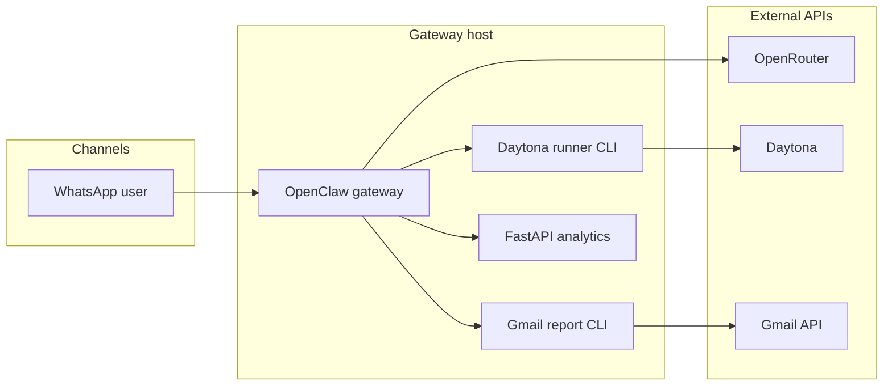

# AquaMind (WaterSec)

AquaMind is a **WaterSec operations assistant** that employees reach on **WhatsApp**. It runs on **OpenClaw**, uses **MiniMax M2.5 (free)** via **OpenRouter** with **latency-aware routing** and **model fallbacks**, executes Python in **Daytona** sandboxes for charts and proofs, and can send **real Gmail incident reports** through the **Gmail API** when someone asks to escalate.

This repository holds **config patches**, **PowerShell helpers**, **CLI tools**, **OpenClaw workspace prompts**, and **sample telemetry CSVs** for demos—**not** secrets or your live `%USERPROFILE%\.openclaw\` state.

---

## What you get

| Area | What’s in the repo |
|------|---------------------|
| **WhatsApp** | OpenClaw channel setup, QR linking, DM/group allowlist script, `@clanker` group wake word (see patch + docs). |
| **Models** | `openclaw/aquamind.patch.json5`: primary `openrouter/minimax/minimax-m2.5:free`, **fallback chain**, **`provider.sort: "latency"`**, turn + HTTP timeouts, `fastModeDefault` on the `main` agent. |
| **Daytona** | `scripts/aquamind_daytona_runner_cli.py` — stdin Python → sandbox → **JSON** (`stdout`, `exit_code`, optional **`signed_chart_url`** for PNG previews). |
| **Gmail** | `scripts/aquamind_gmail_report_cli.py` — stdin **JSON report** → Gmail API (OAuth) → **JSON** result + **SQLite** send log under `%USERPROFILE%\.openclaw\gmail\`. |
| **Gateway** | `scripts/start-watersec-openclaw-gateway.ps1` — loads repo `.env`, runs `openclaw gateway run`. |
| **Agent prompts** | `openclaw/workspace-templates/` → copy into `%USERPROFILE%\.openclaw\workspace\` (`AGENTS.md`, `SOUL.md`, `TOOLS.md`). |
| **Data / demo** | Sample consumption CSVs, `requirements-spike.txt`, `scripts/proof_openrouter_daytona.py`, artifacts and hackathon PDF (see repo root). |
| **SQLite data layer** (`sqlite-backend`) | `scripts/etl/` — builds `data/aquamind.sqlite` from the CSVs; **normalization**, **quality flags**, **trusted metrics**, motifs, anomalies. See [`docs/SQLITE_BACKEND.md`](docs/SQLITE_BACKEND.md). |
| **Analytics API** | `backend/` + `scripts/start-aquamind-backend.ps1` — FastAPI over SQLite for deterministic metrics, motifs, anomalies, and guarded read-only SQL (`http://127.0.0.1:8765`). See [`openclaw/workspace-templates/TOOLS.md`](openclaw/workspace-templates/TOOLS.md). |

---

## Architecture (high level)



---

## Prerequisites

- **Windows** (paths and scripts assume PowerShell). OpenClaw also documents [Windows / WSL2](https://docs.openclaw.ai/windows) if you hit native Windows edge cases.
- **Node.js** (OpenClaw recommends current LTS-style versions; WhatsApp plugin is pinned in [`openclaw/README-WHATSAPP.md`](openclaw/README-WHATSAPP.md)).
- **OpenClaw CLI** — install globally, e.g. `npm install -g openclaw@latest` (see [OpenClaw install](https://docs.openclaw.ai/install/)).
- **Python 3.12+** recommended for local CLIs and venvs.

---

## Quick start

1. **Clone** this repo and open a terminal at the repo root.

2. **Environment**

   ```powershell
   Copy-Item .\.env.example .\.env
   ```

   Fill at least:

   - `OPENROUTER_API_KEY` — for the agent model via OpenClaw.
   - `DAYTONA_API_KEY` — for the Daytona runner (and spike scripts).
   - `WHATSAPP_SELF_E164` — your number in E.164 for the allowlist script.
   - For Gmail reports: `GMAIL_SENDER`, `GMAIL_TO`, plus OAuth files (see below).

3. **Python dependencies** (for CLIs)

   ```powershell
   python -m venv .venv
   .\.venv\Scripts\python.exe -m pip install -r requirements-gmail.txt
   # Optional spike / proof stack:
   .\.venv\Scripts\python.exe -m pip install -r requirements-spike.txt
   # Analytics API (FastAPI over SQLite):
   .\.venv\Scripts\python.exe -m pip install -r requirements-backend.txt
   ```

4. **OpenClaw bootstrap and patches** — follow the step-by-step guide:

   **[`openclaw/README-WHATSAPP.md`](openclaw/README-WHATSAPP.md)**

   Summary of repo scripts you will run from the repo root:

   - `.\scripts\apply-openclaw-aquamind-patch.ps1` — merges model, timeouts, fallbacks, latency sort, group chat mention config, and plugin allowlist into `~\.openclaw\openclaw.json`.
   - `.\scripts\patch-whatsapp-allowlist.ps1` — regenerates allowlist patch from built-in numbers + `WHATSAPP_SELF_E164`.

5. **WhatsApp linking** (interactive QR)

   ```powershell
   openclaw channels login --channel whatsapp
   ```

6. **Copy workspace templates** (after editing templates in git, refresh the live workspace)

   ```powershell
   Copy-Item -Path .\openclaw\workspace-templates\* -Destination "$env:USERPROFILE\.openclaw\workspace" -Force
   ```

7. **Start the gateway**

   ```powershell
   .\scripts\start-watersec-openclaw-gateway.ps1
   ```

8. **(Optional) Telemetry DB + analytics API** — after CSVs are in the repo root:

   ```powershell
   .\.venv\Scripts\python.exe scripts\etl\build_database.py
   .\.venv\Scripts\python.exe scripts\validate_db.py
   .\scripts\start-aquamind-backend.ps1
   ```

   Open `http://127.0.0.1:8765/docs` for interactive API testing.

---

## Gmail incident reports (summary)

- Install deps: `requirements-gmail.txt`.
- Default OAuth client JSON: `%USERPROFILE%\.openclaw\gmail\client_secret.json` (Desktop OAuth client from Google Cloud; enable Gmail API; add test users if app is in **Testing**).
- After first consent, token is stored (default `%USERPROFILE%\.openclaw\gmail\token.json`).
- **Dry run** (no send): `scripts/aquamind_gmail_report_cli.py --dry-run`
- Full details and env vars: [`openclaw/README-WHATSAPP.md`](openclaw/README-WHATSAPP.md) and [`openclaw/workspace-templates/TOOLS.md`](openclaw/workspace-templates/TOOLS.md).

---

## Useful scripts (reference)

| Script | Role |
|--------|------|
| `scripts/start-watersec-openclaw-gateway.ps1` | Load `.env`, run `openclaw gateway run`. |
| `scripts/apply-openclaw-aquamind-patch.ps1` | Apply `openclaw/aquamind.patch.json5`. |
| `scripts/patch-whatsapp-allowlist.ps1` | Build and apply WhatsApp allowlist patch. |
| `scripts/aquamind_daytona_runner_cli.py` | Python in Daytona → JSON (charts → `signed_chart_url`). |
| `scripts/aquamind_gmail_report_cli.py` | JSON report → Gmail API → JSON + SQLite log. |
| `scripts/proof_openrouter_daytona.py` | End-to-end OpenRouter → generated code → Daytona smoke test. |
| `scripts/daytona_artifact_preview.py` | Helper around Daytona artifacts (see script docstring). |
| `scripts/start-aquamind-backend.ps1` | Install `requirements-backend.txt` if needed, run **FastAPI** on `127.0.0.1:8765`. |

---

## Security and hygiene

- **Never commit** `.env`, OAuth `client_secret.json`, or `token.json`. They are listed in `.gitignore` for env and generated files; keep Gmail secrets under `%USERPROFILE%\.openclaw\gmail\`.
- **Rotate keys** if they ever appeared in chat logs or were committed by mistake.
- WhatsApp linking ties the gateway to a real device session—treat the host like production credentials.

---

## SQLite data layer (this branch)

WaterSec telemetry arrives as **four inconsistent CSV exports**. This branch adds an ETL pipeline that loads them into **SQLite**, normalizes to one event schema, flags bad sensor rows, and builds **derived datasets** (daily profiles, device baselines, Customer C **motifs**, anomaly candidates, cautious gym pairing). Optional enrichment: seeded holidays, placeholders for water-stress benchmarks, and [`scripts/fetch_open_meteo.py`](scripts/fetch_open_meteo.py) for **`climate_context`** (network).

**Build locally (Python 3.10+):**

```powershell
python scripts\etl\build_database.py
python scripts\validate_db.py
```

Output: `data\aquamind.sqlite` (ignored by git — regenerate after clone).

**Docs:** [`docs/SQLITE_BACKEND.md`](docs/SQLITE_BACKEND.md) — normalization purpose, cleaning rules, enhancement data. Pitch-oriented summary: [`docs/PITCH_DATA_RESUME.md`](docs/PITCH_DATA_RESUME.md).

---

## Documentation links

- OpenClaw: [https://docs.openclaw.ai/](https://docs.openclaw.ai/)
- OpenClaw WhatsApp: [https://docs.openclaw.ai/channels/whatsapp](https://docs.openclaw.ai/channels/whatsapp)
- OpenRouter + OpenClaw cookbook: [https://openrouter.ai/docs/cookbook/coding-agents/openclaw-integration](https://openrouter.ai/docs/cookbook/coding-agents/openclaw-integration)
- **Full bootstrap & troubleshooting:** [`openclaw/README-WHATSAPP.md`](openclaw/README-WHATSAPP.md)

---

## Repository layout (short)

- `openclaw/` — JSON5 merge patches and workspace templates for the agent.
- `backend/` — FastAPI analytics service over `data/aquamind.sqlite`.
- `scripts/` — gateway, patches, Daytona runner, Gmail CLI, proofs, **SQLite ETL** (`scripts/etl/`).
- `docs/` — SQLite backend, data inventory, pitch resume, agent data rules.
- `data/` — optional local folder for generated `aquamind.sqlite` (see `.gitignore`).
- `artifacts/` — demo outputs (e.g. charts, HTML) when generated.
- Root CSVs / PDF — WaterSec hackathon and sample consumption data for analytics demos.
