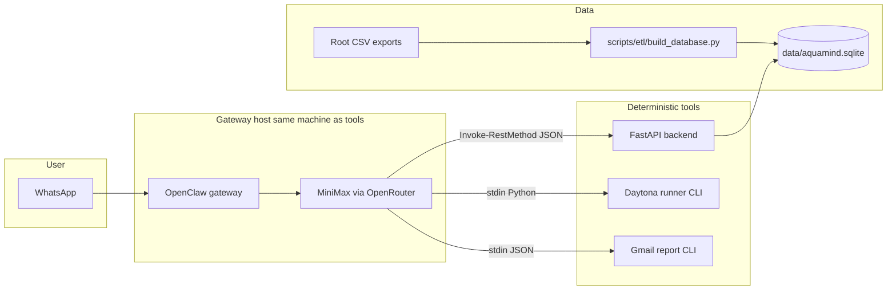

# AquaMind — full integration context (for humans and agents)

If you are pointed at this **repository branch** (for example `feature/sqlite-fastapi-backend`), treat this file as the **single onboarding map**. Read it first, then follow the linked docs in order.

If you only have a **copy** of `AGENTS.md` / `TOOLS.md` under `%USERPROFILE%\.openclaw\workspace\`, open this same document from your **git clone**: `docs/ARCHITECTURE.md` at the repo root (relative links inside copied templates assume the repo tree).

## Reading order (minimum context to implement or extend)

1. This file (`docs/ARCHITECTURE.md`) — end-to-end flow and responsibilities.
2. [`docs/SQLITE_BACKEND.md`](SQLITE_BACKEND.md) — how CSVs become SQLite, trusted vs raw, derived tables.
3. [`docs/AGENT_DATA_RULES.md`](AGENT_DATA_RULES.md) — what the model may claim vs must caveat.
4. [`openclaw/workspace-templates/TOOLS.md`](../openclaw/workspace-templates/TOOLS.md) — **concrete tool contracts**: FastAPI routes, PowerShell examples, Gmail CLI, Daytona runner.
5. [`openclaw/workspace-templates/AGENTS.md`](../openclaw/workspace-templates/AGENTS.md) — **agent execution policy** (when to use HTTP vs sandbox vs Gmail).
6. [`backend/main.py`](../backend/main.py) — authoritative list of HTTP routes and behavior.

Optional deeper data narrative: [`docs/BEGINNER_DATA_GUIDE.md`](BEGINNER_DATA_GUIDE.md), [`docs/DATA_INVENTORY.md`](DATA_INVENTORY.md).

## End-to-end data flow



- **User** talks on WhatsApp → **OpenClaw** runs the agent → **MiniMax** decides which tool to call.
- **Telemetry numbers** (aggregates, comparisons, motifs, anomaly rows, guarded SQL) must come from the **FastAPI** service reading **`data/aquamind.sqlite`**, not from the model guessing over raw CSV text.
- **Charts / matplotlib** run in **Daytona** via `scripts/aquamind_daytona_runner_cli.py` (sandbox), not inside FastAPI unless you add that later.
- **Gmail** is still the existing **CLI** (`scripts/aquamind_gmail_report_cli.py`); FastAPI `/health` only reports whether Gmail-related env vars look set.

## SQLite lifecycle (not “data only in git”)

1. Root CSVs (`customer*_consumption.csv`, `gym_consumption_data.csv`) are in the repo.
2. **`python scripts/etl/build_database.py`** (from repo root) builds **`data/aquamind.sqlite`** (gitignored except `data/.gitkeep`).
3. **`python scripts/validate_db.py`** sanity-checks counts and key tables.
4. Start **`scripts/start-aquamind-backend.ps1`** so FastAPI serves read-only queries against that file.

If `aquamind.sqlite` is missing, `GET /health` returns `db_exists: false` and the agent should tell the user to run the ETL step above.

## OpenClaw workspace (critical)

Templates in **`openclaw/workspace-templates/`** are **not** automatically what the live gateway reads. After editing templates in git, refresh the live workspace on the gateway machine:

```powershell
Copy-Item -Path .\openclaw\workspace-templates\* -Destination "$env:USERPROFILE\.openclaw\workspace" -Force
```

The agent’s behavior is governed by **`AGENTS.md`** + **`TOOLS.md`** in that live folder.

## Environment variables (summary)

| Variable | Role |
|----------|------|
| `OPENROUTER_API_KEY` | Model access (OpenClaw). |
| `DAYTONA_API_KEY` | Daytona runner. |
| `GMAIL_*` | Gmail CLI OAuth paths and sender/recipient. |
| `AQUAMIND_DB_PATH` | Optional override path to `aquamind.sqlite`. |
| `AQUAMIND_API_BASE` | Optional; agent docs default to `http://127.0.0.1:8765` if unset. |
| `AQUAMIND_CORS_ORIGINS` | Comma list for FastAPI CORS (default `*`). |

See [`.env.example`](../.env.example) for the full list.

## Branch-specific note

Integration described here matches branches that include:

- `scripts/etl/` and `docs/SQLITE_BACKEND.md`
- `backend/` FastAPI package
- Updated `openclaw/workspace-templates/AGENTS.md` and `TOOLS.md`

If you are on **`main`** only, confirm whether FastAPI and ETL are merged before assuming paths above exist.

## Planned extension (not required for first test)

- **`POST /tools/ingest_csv`** (future): accept validated CSV + profile, load into `raw_*` tables, refresh normalized data so agents can update telemetry without shell access. Documented as a stub in `TOOLS.md` until implemented.

## Security reminders

- Never commit `.env`, OAuth secrets, or generated `data/*.sqlite`.
- `POST /tools/run_sql_readonly` is **read-only** and keyword-guarded; it is not a general SQL write surface.
